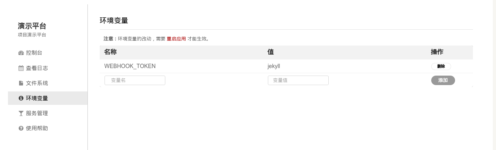
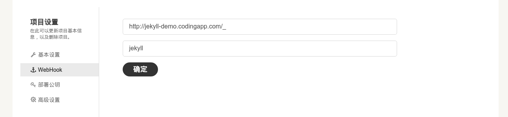

#如何搭建一个 Jekyll 博客
#####一 简单用法
1. `Fork` 这个项目，然后 `git clone` 你的项目到本地
2. 在 `_posts` 文件夹里新建一个符合`:year-:month-:day-:title.md`格式的文件来撰写你的文章
3. `push` 后，点击一键部署，就可以访问你的 Jekyll 博客了

#####二 push 自动部署的方法（推荐）
1. 点击**演示**，**环境变量**，设置 WEBHOOK_TOKEN 变量为**任意值**


2. 点击设置，webhook，设置 url 为 "应用地址/\_"，token 设为第2步的 WEBHOOK_TOKEN 值
 

3. 重启应用

#####三 本地预览
如果需要本地预览博客的话，需要先安装 `Jekyll`，确保你的系统内已安装 [Ruby](https://www.ruby-lang.org)，然后执行：

```bash
gem install jekyll
```
接着在项目内执行下面的命令启动本地服务器：

```bash
jekyll serve
```
更复杂的用法请参考 [jekyll 教程](http://jekyllcn.com/docs/home/)